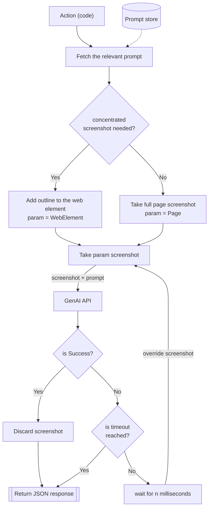

# ViTO — Visual Test Oracle


A Playwright + BDD test automation framework that replaces brittle assertion code with natural-language AI prompts. Instead of writing code to verify that a widget loaded correctly, a chart rendered in the right order, or a UI state changed as expected — you describe what "pass" looks like in plain English and let an OpenAI vision model evaluate the screenshot.

---

## Why ViTO

Conventional UI assertion code is expensive to write and even more expensive to maintain. A UI change — a renamed attribute, a shifted DOM element, a new widget variant — can silently break dozens of assertions. At scale, across many customers with customised platforms, this creates a maintenance burden that compounds over time.

ViTO takes a **hybrid approach**: use code for actions (clicking, filling, selecting), and use GenAI for assertions (did this work correctly?). This eliminates assertion code that is tied to DOM structure, making tests resilient to UI changes by design.

**Key gains:**
- 50% reduction in assertion source code
- Modifying a test means editing a prompt, not refactoring code
- Resilient to minor UI changes that would break hardcoded selectors
- Handles unknown visual states — the AI sees the UI as a human would

---

## How It Works

ViTO follows a three-step loop for every AI assertion:

1. **Screenshot** — capture the full page or a specific element
2. **Evaluate** — send the screenshot and a natural-language prompt to the OpenAI API
3. **Retry or return** — if the result is `fail`, wait and retry; if `pass` or timeout is reached, return the JSON response

### Code Flow



> The flow diagram above is also available as an image in [`docs/vito-flow.png`](docs/vito-flow.png).

The response is always a structured `PromptResponse` object:

```json
{ "result": "pass", "message": "All products are sorted by price in ascending order." }
```

---

## Prerequisites

| Requirement | Version |
|---|---|
| [Node.js](https://nodejs.org/) | **24.12.0** (use `nvm use 24.12.0`) |
| [npm](https://www.npmjs.com/) | Bundled with Node |
| An [OpenAI API key](https://platform.openai.com/api-keys) | — |
| A Chromium-capable display (non-headless) | — |

> `headless: false` is intentional. OpenAI vision assertions require a fully rendered browser window to produce accurate screenshots.

---

## Setup

**1. Clone the repository**

```bash
git clone <repo-url>
cd vito
```

**2. Use the correct Node version**

```bash
nvm use 24.12.0
```

**3. Install dependencies**

```bash
npm install
```

**4. Install Playwright browsers**

```bash
npx playwright install
```

**5. Configure environment variables**

Copy `.env.example` to `.env` and fill in your values:

```bash
cp .env.example .env
```

| Variable | Required | Description |
|---|---|---|
| `SAUCE_USERNAME` | Yes | Username for the [SauceDemo](https://www.saucedemo.com/) test site |
| `SAUCE_PASSWORD` | Yes | Password for the SauceDemo test site |
| `OPENAI_API_KEY` | Yes | Your OpenAI API key for vision-based assertions |
| `OPENAI_MODEL` | No | The OpenAI model to use (defaults to `gpt-4o`) |

---

## Running Tests

**Generate BDD spec files from feature files (required before first run and after any `.feature` change):**

```bash
npx bddgen
```

**Run the full test suite:**

```bash
npx playwright test
```

**Run in a specific browser:**

```bash
npx playwright test --project=chromium
```

**View the HTML report after a run:**

```bash
npx playwright show-report
```

---

## Project Structure

```
src/
  components/<component-name>/   ← one folder per UI component
    <component>.ts               ← component class (exported as singleton)
    selectors.ts                 ← static CSS/attribute selectors
    prompts.ts                   ← AI prompt strings (only if AI assertions are used)
    expectedTexts.ts             ← expected text constants for pass/fail criteria
  utils/
    types.ts                     ← all shared TypeScript types and interfaces
    aiUtils/
      genAI.ts                   ← OpenAI API client (internal — do not import directly)
      helperPrompts.ts           ← reusable prompt-building helpers
      index.ts                   ← public AI utility API (runPrompt, compareScreenshotsWithAI)
features/                        ← Gherkin .feature files
step-definitions/                ← Playwright BDD step implementations
```

---

## Writing Your Own Tests

### 1. Create a component folder

```
src/components/my-feature/
  my-feature.ts
  selectors.ts
  prompts.ts          ← only if using AI assertions
  expectedTexts.ts    ← only if using AI assertions
```

### 2. Define selectors

```ts
// src/components/my-feature/selectors.ts
export class MyFeatureSelectors {
  static readonly someButton: string = 'button[data-test="some-button"]';
}
```

### 3. Define expected texts and prompts (AI assertions only)

```ts
// src/components/my-feature/expectedTexts.ts
export const expectedTexts = {
  checkSomething: 'pass if the widget is fully loaded and shows data',
};
```

```ts
// src/components/my-feature/prompts.ts
import { suffixJsonPrompt } from '../../utils/aiUtils/helperPrompts';
import { expectedTexts } from './expectedTexts';

export const assertSomething = `
Describe what to check in the screenshot.
${suffixJsonPrompt(expectedTexts.checkSomething)}
`;
```

### 4. Write the component class

```ts
// src/components/my-feature/my-feature.ts
import { Page } from '@playwright/test';
import { runPrompt } from '../../utils/aiUtils';
import { assertSomething } from './prompts';

class MyFeature {
  constructor() {}

  async checkSomething(page: Page): Promise<boolean> {
    const promptResponse = await runPrompt(assertSomething, page, 'my-feature-check.png');
    return promptResponse.result.toLowerCase() === 'pass';
  }
}

export default new MyFeature();
```

### 5. Write a feature file and step definitions

```gherkin
# features/my-feature.feature
Feature: My Feature

  Scenario: Check something loads
    Given I am on the page
    Then the widget should be loaded
```

```ts
// step-definitions/my-feature.steps.ts
import { Page } from '@playwright/test';
import { createBdd } from 'playwright-bdd';
import MyFeature from '../src/components/my-feature/my-feature';
import assert from 'assert';

const { Given, Then } = createBdd();

Given('I am on the page', async ({ page }: { page: Page }): Promise<void> => {
  await page.goto('https://your-app-url.com/');
});

Then('the widget should be loaded', async ({ page }: { page: Page }): Promise<void> => {
  assert(await MyFeature.checkSomething(page), 'Widget did not load correctly');
});
```

### 6. Regenerate specs and run

```bash
npx bddgen && npx playwright test
```

---

## Linting

```bash
npm run lint        # check for issues
npm run lint:fix    # auto-fix issues
```

The codebase enforces tabs, explicit return types, explicit parameter types, and zero use of `any`.

---

## When Not to Use AI Assertions

GenAI assertions are powerful but not always the right tool. Prefer conventional Playwright assertions for:

- **Deterministic flows** where the UI never changes (e.g., a login form)
- **Exact value checks** where the expected value is known at test-write time (e.g., an exact error message)
- **High-volume, low-complexity checks** where API cost and latency would not be justified

Use AI assertions for complex visual states, widget rendering, chart validation, and anything where the expected visual state is easier to describe in words than to encode in selectors.

---

## License

ISC
